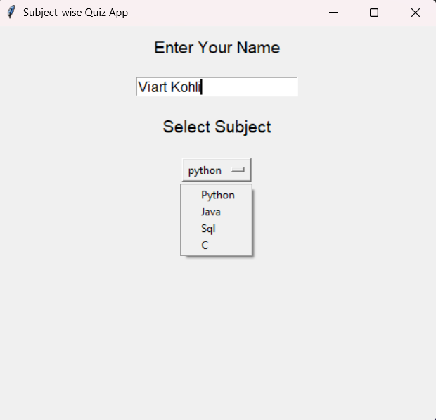
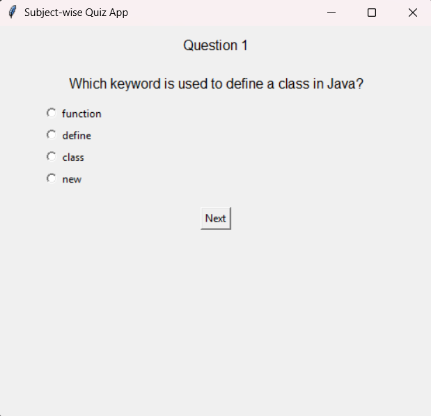
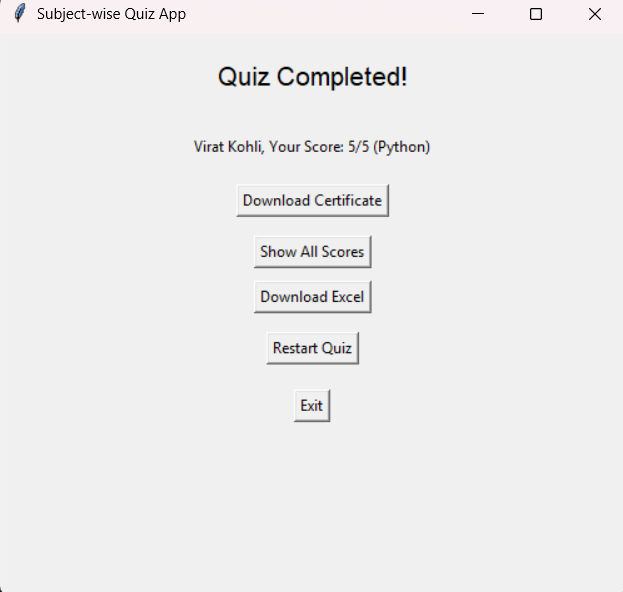
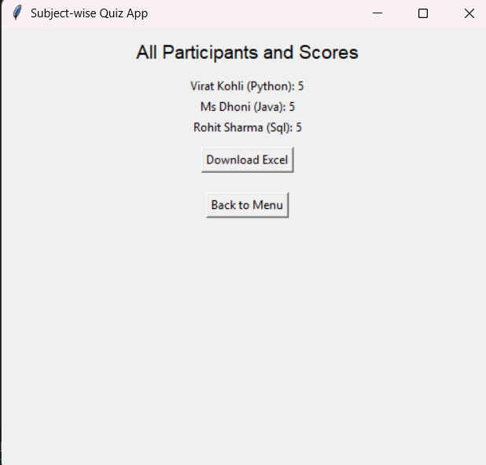
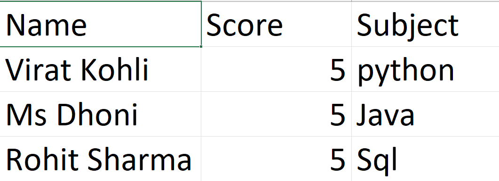

# Subject-wise Quiz Application
# Python Quiz App
## About the Project

This is a **Subject-wise Quiz Application** developed using **Python** with **Tkinter** for GUI and **MySQL** for database management. Users can select a subject (Python, Java, SQL, C), attempt MCQ quizzes, view their scores, generate certificates if eligible, and download all results into an Excel file.

This project was developed by **Purvarajsinh** as a part of **college projects for Semester 4**.

---

## Features

- **User Name & Subject Selection** before starting the quiz.
- **Subject-wise MCQ Quizzes** (Python, Java, SQL, C).
- **Score Calculation** and **Result Storage** in MySQL database.
- **Certificate Generation** (only if the user scores 50% or above).
- **View All Participants' Scores**.
- **Download Results as Excel File** (.xlsx).

---

## Technologies Used

- **Python 3**
- **Tkinter** (for GUI)
- **MySQL** (Database)
- **PIL (Pillow)** (for certificate generation)
- **openpyxl** (for exporting results to Excel)

---


## 📷 Pictures Of Project
### 1. 🏠 Home Screen


### 2. ❓ Question Screen


### 3. ✅ Quiz Completed


### 4. 🏆 Certificate (Example)


### 5. 📊 All Participant Scores


### 6. 📥 Excel Export


## Setup Instructions

1. **Install Python 3**

   - [Download Python](https://www.python.org/downloads/)

2. **Install Required Libraries**

   ```bash
   pip install mysql-connector-python
   pip install pillow
   pip install openpyxl
   ```

3. **Setup MySQL Database**

   - Install MySQL Server.
   - Start MySQL server and create a user `root` with no password (or modify the connection settings in the code).

4. **Prepare Certificate Template**

   - Place a certificate background image named `quiz.jpg` in the project directory.
   - Place the font file `BRUSHSCI.TTF` (or update the font path in the code).

5. **Run the Application**

   ```bash
   python quiz_app.py
   ```

---

## Notes

- If no questions exist initially, the app will auto-insert sample questions.
- Ensure MySQL server is running before starting the application.
- Make sure `quiz.jpg` and font file are available in the same directory as the script.

---

## Developer

**Purvarajsinh**\
*Developed as a College Project for Semester 4*

---

## License

This project is for educational purposes.

---

# Thank You for Visiting the Repository! 🎉

